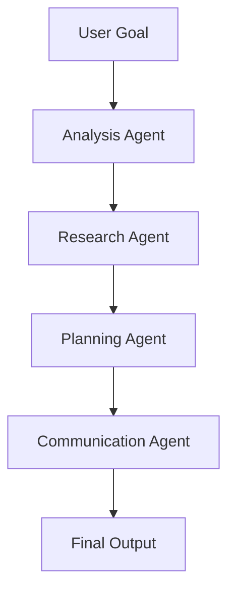

# 🚀 Multex-AI

> An AI-powered multi-agent system that breaks down your goals into actionable tasks using analysis, research, planning, and communication agents — built with a modular microservices architecture, powered by LLMs.

[](https://opensource.org/licenses/MIT)
[](https://nodejs.org/)
[](https://docker.com/)

## 📋 Table of Contents

- [Overview](#-overview)
- [Features](#-features)
- [Architecture](#-architecture)
- [Tech Stack](#-tech-stack)
- [Quick Start](#-quick-start)
- [Installation](#-installation)
- [Usage](#-usage)
- [Project Structure](#-project-structure)
- [API Reference](#-api-reference)
- [Contributing](#-contributing)
- [License](#-license)
- [Support](#-support)

## 🎯 Overview

Multex-AI is an intelligent system powered by modular agents that collaborate to complete user-provided tasks. It uses a goal-driven architecture inspired by human team dynamics, breaking down complex objectives into manageable, actionable steps.

### 🧠 How It Works

1. **Goal Input**: Users provide high-level goals or tasks
2. **Analysis**: The system breaks down goals into subtasks
3. **Research**: Relevant information is gathered from various sources
4. **Planning**: Structured plans and schedules are created
5. **Communication**: User-friendly reports and summaries are generated

## ✨ Features

- 🤖 **Multi-Agent Architecture**: Collaborative AI agents working together
- 🎯 **Goal-Driven Processing**: Break down complex tasks into actionable steps
- 🔄 **Modular Design**: Scalable and maintainable microservices
- 🚀 **Docker Ready**: Easy deployment with containerization
- 📊 **Real-time Processing**: Efficient task execution and monitoring
- 🔌 **Extensible**: Easy to add new agents and capabilities

## 🏗️ Architecture

### Agent Breakdown

| Agent | Role | Description |
|-------|------|-------------|
| 🧩 **Analysis Agent** | Task Breakdown | Breaks down goals into subtasks using LLMs |
| 🔍 **Research Agent** | Information Gathering | Gathers information from various sources |
| 📝 **Planning Agent** | Strategy Creation | Creates plans and schedules from structured information |
| 📢 **Communication Agent** | Output Generation | Prepares reports, summaries, and user-friendly output |

### System Flow



## 🛠️ Tech Stack

### Backend
- **Runtime**: Node.js (TypeScript)
- **Framework**: Express.js
- **Automation**: n8n (No-code automation)
- **Database**: PostgreSQL
- **AI/LLM**: OpenAI API / Claude / DeepSeek

### DevOps & Deployment
- **Containerization**: Docker & Docker Compose
- **Reverse Proxy**: NGINX
- **Configuration**: Environment-based config separation
- **Data Persistence**: PostgreSQL volume & n8n data volume

### Frontend (Coming Soon)
- **Framework**: React + Tailwind CSS
- **Build Tool**: TypeScript + Vite
- **UI**: Multi-agent interaction interface

## ⚡ Quick Start

### Prerequisites

- Node.js >= 18.x
- Docker + Docker Compose
- OpenAI API Key (or any other LLM key)
- n8n workflow knowledge

### Clone & Setup

```bash
# Clone the repository
git clone https://github.com/iOmSharma/multex-ai.git
cd multex-ai

# Build and start with Docker
docker-compose up --build
```

## 📦 Installation

### Option 1: Docker (Recommended)

```bash
# Make sure Docker is running
docker-compose up --build
```

### Option 2: Local Development

```bash
# Install dependencies
cd app/api-gateway
npm install

# Set up environment variables
cp .env.example .env
# Edit .env with your API keys

# Start development server
npm run dev
```

## 🚀 Usage

### API Endpoints

| Endpoint | Method | Description |
|----------|--------|-------------|
| `/api/analysis` | POST | Submit goals for analysis |
| `/api/research` | POST | Request research on topics |
| `/api/planning` | POST | Generate plans and schedules |
| `/api/communication` | POST | Create reports and summaries |

### Example Request

```bash
curl -X POST http://localhost:8000/api/analysis \
  -H "Content-Type: application/json" \
  -d '{
    "goal": "Launch a new SaaS product",
    "context": "B2B software for small businesses"
  }'
```

## 📁 Project Structure

```
multex-ai/
├── 📁 app/
│   └── 📁 api-gateway/
│       ├── 📁 src/
│       │   ├── 📁 agents/
│       │   │   ├── analysis.ts
│       │   │   ├── communication.ts
│       │   │   ├── planning.ts
│       │   │   ├── research.ts
│       │   │   └── index.ts
│       │   ├── 📁 routes/
│       │   │   ├── analysis.ts
│       │   │   ├── communication.ts
│       │   │   ├── planning.ts
│       │   │   ├── research.ts
│       │   │   └── index.ts
│       │   ├── 📁 utils/
│       │   │   └── request.ts
│       │   ├── app.ts
│       │   └── index.ts
│       ├── .env
│       ├── tsconfig.json
│       ├── package.json
│       └── Dockerfile
├── 📁 workflows/
│   └── (exported .json workflows from n8n)
├── 📁 docker/
│   ├── nginx.conf
│   ├── 📁 env/
│   │   ├── api.env
│   │   ├── n8n.env
│   │   └── postgres.env
│   └── 📁 Dockerfiles/
│       └── nginx.Dockerfile
├── 📁 frontend/ (coming soon)
├── docker-compose.yml
└── README.md
```

## 🌐 Service Ports

| Service | Port | Description |
|---------|------|-------------|
| **API Gateway** | 8000 | Main API endpoints |
| **n8n** | 5678 | Workflow automation |
| **PostgreSQL** | 5432 | Database |
| **Frontend** | 5173 | Web interface (coming soon) |

## 📚 API Reference

### Analysis Agent

**Endpoint**: `POST /api/analysis`

**Request Body**:
```json
{
  "goal": "string",
  "context": "string",
  "constraints": "string (optional)"
}
```

**Response**:
```json
{
  "success": true,
  "data": {
    "subtasks": ["task1", "task2", "task3"],
    "priority": "high|medium|low",
    "estimatedTime": "2-3 hours"
  }
}
```

## 🤝 Contributing

We welcome contributions! Here's how you can help:

1. **Fork** the repository
2. **Create** a feature branch (`git checkout -b feature/amazing-feature`)
3. **Commit** your changes (`git commit -m 'Add amazing feature'`)
4. **Push** to the branch (`git push origin feature/amazing-feature`)
5. **Open** a Pull Request

### Development Guidelines

- Follow TypeScript best practices
- Add tests for new features
- Update documentation as needed
- Follow the existing code style

## 📄 License

This project is licensed under the MIT License - see the [LICENSE](LICENSE) file for details.

## 💬 Support

### Get Help

- 📧 **GitHub Issues**: [Create an issue](https://github.com/iOmSharma/multex-ai/issues)
- 💬 **Discussions**: [Join the discussion](https://github.com/iOmSharma/multex-ai/discussions)
- 📱 **Contact**: DM me on GitHub [@iOmSharma](https://github.com/iOmSharma)

### Resources

- 📖 [Documentation](https://github.com/iOmSharma/multex-ai/wiki)
- 🐛 [Bug Reports](https://github.com/iOmSharma/multex-ai/issues)
- 💡 [Feature Requests](https://github.com/iOmSharma/multex-ai/issues)

---

<div align="center">

**Built with ☕, 💻, ❤️ by [Om Sharma](https://github.com/iOmSharma)**

[](https://github.com/iOmSharma)

</div>
